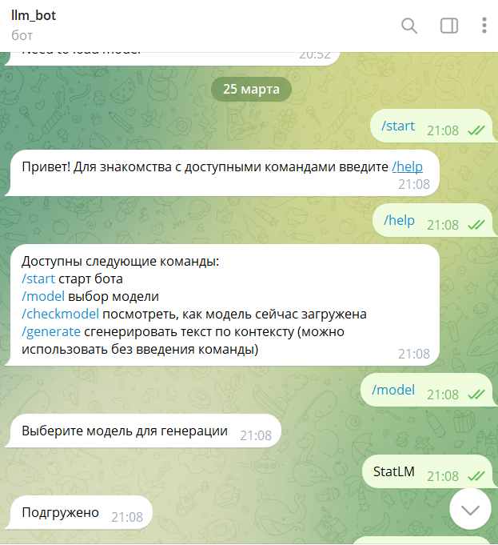
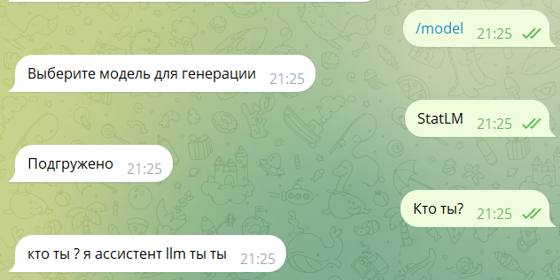
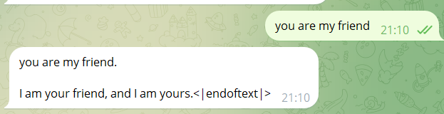

## Overview

This is a telegram-bot project. After entering the TOKEN of your own robot, run the file(llm_assistant_bot.py) to start the llm assistant.
There are 3 models of this assistant: StatLM (n-gram) , GPT (trained gpt2) , Llama (meta-llama/Llama-2-7b-hf).Because llama is too big, it is commented out by default.

Because these models are too large, they are stored in the cloud disk by me : https://drive.google.com/drive/folders/1EVOb-mqurYdknBPzb9XaHD4hSjLHHCBE?usp=drive_link

```python
python llm_assistant_bot.py
```
## Version
Python 3.10.13

torch 2.2.1+cu121

transformers  4.38.2

## File description

* folder "data": Training data used in gpt2

* folder "models": Store trained gpt2 and ngram models

* 11.ipynb : Process the training data required for gpt2 and calculate the perplexity of the model

* asisstant_1.ipynb: train n-grams model

* train_gpt.py: train gpt2 model

## What did i do
n-grams:
* I added  Backoff method to the Laplace smoothing method
* I modified some hyperparameters.
* I trained the model using the dataset Den4ikAI/russian_dialogues.

gpt2:
* I trained the model using the dataset :daily_dialog .
* I calculated the perplexity of the model before and after training, and found that the perplexity before training was 41.11988067626953, and after training it was 4.673332214355469, and the perplexity decreased significantly.

## Final result
* Stat-lm(n-gram)



* gpt


